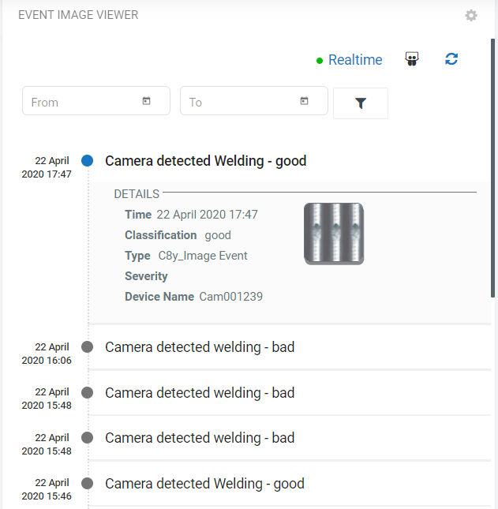
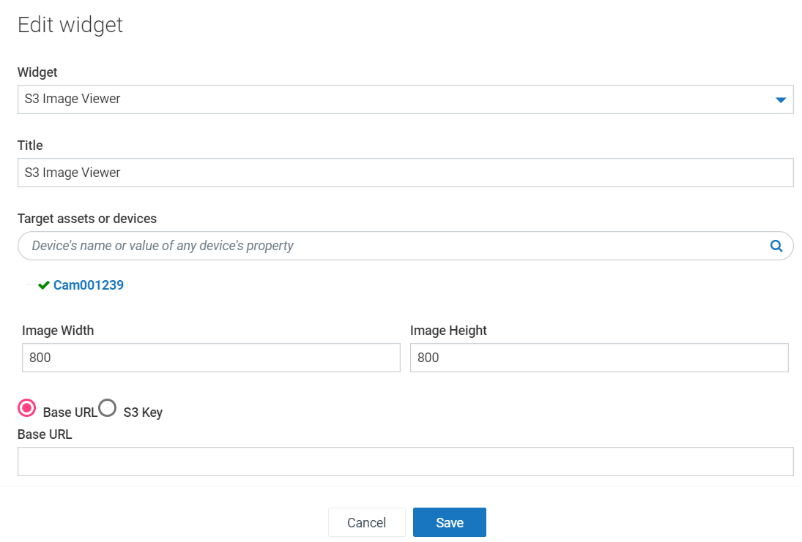
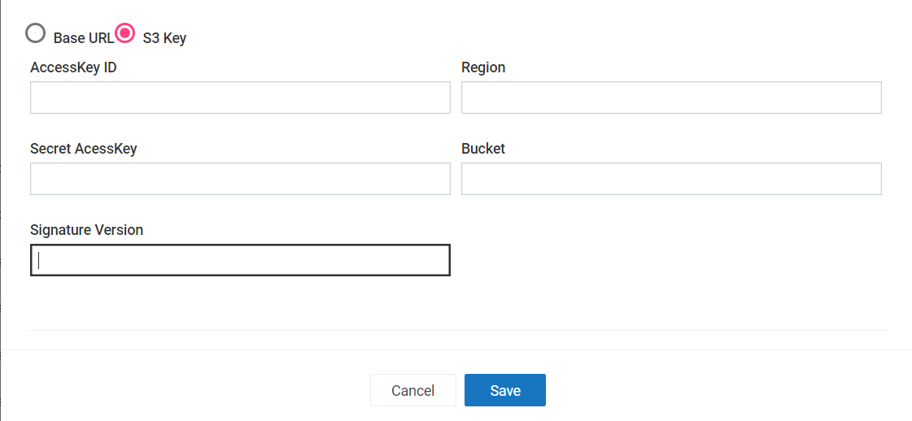

# Event Image Viewer Widget for Cumulocity 

This Event Image Viewer Widget is the Cumulocity module federation plugin created using c8ycli. This plugin can be used in Application Builder or Cockpit.
The Event Image Viewer widget help you to to display the events that are created whenever the image is captured by the camera.

### Please choose Event Image Viewer release based on Cumulocity/Application builder version:

| APPLICATION BUILDER &nbsp;|&nbsp; CUMULOCITY &nbsp; |&nbsp; EVENT IMAGE VIEWER WIDGET&nbsp; |
|---------------------|-------------|---------------------------|
| 2.x.x               | >= 1016.x.x | 1.x.x                     | 

## Prerequisite
   Cumulocity c8ycli >=1016.x.x
   
## Features

 *  **Displays the events.**
 *  **Displays the captured images.** 
 *  **Uses AI Predictive analytics for image classification** 
 
## Installation

### Runtime Widget Deployment?

* This widget support runtime deployment. Download [Runtime Binary](https://github.com/SoftwareAG/cumulocity-event-image-viewer-widget-plugin/releases/download/1.0.2/sag-ps-pkg-event-image-viewer-runtime-widget-1.0.2.zip) and install via Administrations --> Ecosystems --> Applications --> Packages.

## QuickStart
This guide will teach you how to add widget in your existing or new dashboard.

1. Open the Application Builder from the app switcher (Next to your username in the top right)

2. Click Add application

3. Enter the application details and click Save

4. Select Add dashboard

5. Click Blank Dashboard

6. Enter the dashboard details and click Save

7. Select the dashboard from the navigation

8. Check for your widget and test it out.

Congratulations! Event Image Viewer Widget is configured.

## User Guide

1. Target Assets/Devices - select group of interest

------------------------------

This Widget is provided as-is and without warranty or support. They do not constitute part of the Software AG product suite. Users are free to use, fork and modify them, subject to the license agreement. While Software AG welcomes contributions, we cannot guarantee to include every contribution in the master project.
_____________________
For more information you can Ask a Question in the [TECH Community Forums](https://tech.forums.softwareag.com/tag/Cumulocity-IoT).
